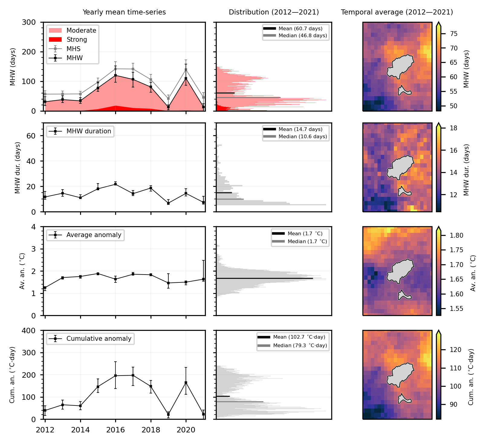
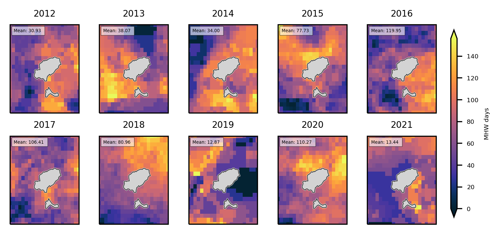

# MHW Metrics package

'MHW_metrics' is a Python package that enables easy computation of yearly averages of Marine Heat Wave (MHW) metrics from Sea Surface Temperature (SST) netCDF4 files. The package is based on the MHW definition from Hobday et al. (2016) and was initially created for the satellite data analysis of Rosselló et al. (2023). The package is primarily intended for Copernicus Marine Service (CMEMS) datasets such as SST_GLO_SST_L4_REP_OBSERVATIONS_010_011 and SST_MED_SST_L4_REP_OBSERVATIONS_010_021, but it may also be compatible with other daily SST datasets.

[](https://zenodo.org/badge/latestdoi/637851848)

## Features

- For a given netCDF4 file containing daily SST data for a specific region, compute the following metrics per grid cell and per year:

    - MHW days
    - Marine Heat Spikes (MHS)
    - Mean MHW SST anomaly
    - Cumulative MHW SST anomaly
    - Mean MHW duration

- Either a fixed baseline or moving baseline can be used. The baseline period length can be adjusted. 

- Compute the yearly distribution of these metrics for each MHW event in the region. For example, for each year, get a distribution of the duration of all MHW events that have occurred in the region.

- If there is a daily interpolation error in the SST time series, it can be incorporated to calculate upper and lower bounds of MHW metrics considering such error.


## Installation

```bash
pip install git+https://github.com/canagrisa/MHW_metrics.git
```

## Usage

```python 

from MHW_metrics import main
from MHW_metrics import plot_utils

path = 'path_to_dataset'
ds = xr.open_dataset(path)

baseline_year_length = 30  # Set the baseline length
baseline_type = "fixed_baseline"  # Set the type of baseline

# Where to save the data
out_folder = '../results/'

# Compute the MHW Metrics
main.MHW_metrics_satellite(
    ds,
    baseline_year_length,
    baseline_type,
    out_folder=out_folder,
    var="analysed_sst",
    distribution=True,
    error=True, 
)

#Represent the results (example figures below)

#Figure 1
plot_utils.mhw_metrics(out_folder, ratio=1.1, proportions = [3.5, 2.5, 2])

#Figure 2
ds = xr.open_mfdataset(f"{out_folder}/*.nc", combine="by_coords").compute()
plot_utils.MHW_year_array(ds, 'MHW', label = 'MHW days')

```

## Example Figures


Example figure of MHW metrics using a 30-year fixed baseline for a SST dataset (1982-2021) cropped around Ibiza.


Example figure of MHW days per year using a 30-year fixed baseline for a SST dataset (1982-2021) cropped around Ibiza.


## License

MIT License. See the LICENSE file for more information.

## Support and Contributions

For support or to report bugs, please open a GitHub issue. Contributions are welcome! Feel free to submit a pull request or suggest new features by opening an issue

## Acknowledgments

This package uses the MHW definition and methodology of Hobday et al. (2016) and Hobday et al. (2018).
